# Story Creator - Architecture Diagram

## System Architecture (Web-Based)


## Data Flow Examples

### Example 1: Create World with GPT Analysis (Async)

```mermaid
sequenceDiagram
    participant User
    participant Frontend as Frontend<br/>(Browser JS)
    participant API as Flask API<br/>/api/gpt/analyze
    participant Service as GPT Service
    participant GPT as OpenAI<br/>GPT-4o-mini
    participant Session as Session Storage
    participant Create as /api/worlds

    User->>Frontend: Fill form & click "Phân Tích với GPT"
    Frontend->>Frontend: Get description & world_type
    Frontend->>Frontend: Show loading spinner

    Frontend->>API: POST /api/gpt/analyze<br/>{description, world_type}
    API->>API: Generate task_id
    API->>Session: Store {task_id: {status: 'pending'}}

    API->>Service: analyze_world_entities(desc, type, callbacks)
    Service->>Service: Start background thread
    API-->>Frontend: Return {task_id: "uuid"}

    Service->>GPT: Send prompt to OpenAI API
    Frontend->>API: Poll every 500ms<br/>GET /api/gpt/results/task_id
    API-->>Frontend: {status: 'pending'}

    GPT-->>Service: Return entities & locations JSON
    Service->>Service: Parse JSON
    Service->>Session: Update {status: 'completed', result: {...}}

    Frontend->>API: Poll GET /api/gpt/results/task_id
    API->>Session: Check status
    API-->>Frontend: {status: 'completed', result: {...}}

    Frontend->>Frontend: Show success toast
    Frontend->>Frontend: Display entities preview

    User->>Frontend: Click "Tạo Thế Giới"
    Frontend->>Create: POST /api/worlds<br/>{name, description, gpt_entities}
    Create->>Create: Create world with entities
    Create-->>Frontend: {success: true, world: {...}}
    Frontend->>Frontend: Redirect to world details
```

### Example 2: Create Story with Auto Character Detection

```mermaid
sequenceDiagram
    participant User
    participant Frontend as Frontend<br/>(Browser JS)
    participant API as /api/stories
    participant CharSvc as Character Service
    participant StoryGen as Story Generator
    participant Storage as Storage Layer

    User->>Frontend: Fill story form<br/>(mention character names)
    User->>Frontend: Click "Tạo Câu Chuyện"

    Frontend->>API: POST /api/stories<br/>{world_id, genre, description, time_index}

    API->>Storage: load_world(world_id)
    Storage-->>API: world_data

    API->>Storage: Load all entities in world
    Storage-->>API: entity_list

    API->>CharSvc: detect_mentioned_characters(description, entities)
    CharSvc->>CharSvc: Parse description for names
    CharSvc->>CharSvc: Match with entity database
    CharSvc->>CharSvc: Filter out dangerous creatures
    CharSvc-->>API: (character_names, entity_ids)

    API->>StoryGen: generate(description, world_id, genre, entities)
    StoryGen->>StoryGen: Create Story object
    StoryGen->>StoryGen: Link detected entities
    StoryGen->>StoryGen: Generate title
    StoryGen-->>API: story

    API->>StoryGen: generate_time_cone(story, world_id, time_index)
    StoryGen-->>API: time_cone

    API->>Storage: save_story(story)
    API->>Storage: save_time_cone(time_cone)
    API->>Storage: Update world.stories

    API-->>Frontend: {success: true, story: {...}, time_cone: {...}}

    Frontend->>Frontend: Show success toast
    Frontend->>Frontend: Refresh story list
```



### Example 3: View World Details with Tabs


## Component Responsibilities

### Client Layer (Frontend)
**Responsibility**: User interaction and presentation
- Render UI with TailwindCSS/DaisyUI components
- Handle user input events
- Make async HTTP requests to backend
- Update DOM dynamically
- Poll GPT task results
- Display toast notifications
- Format data for display

**Does NOT**:
- Contain business logic
- Access database directly
- Make OpenAI API calls
- Store persistent data (only session/localStorage)

### Web Server Layer (Flask)
**Responsibility**: HTTP routing and request handling
- Define REST API endpoints
- Parse HTTP requests (JSON)
- Validate input data
- Call appropriate services
- Return JSON responses
- Manage session state
- Handle GPT task tracking
- Serve HTML templates and static files

**Does NOT**:
- Implement business logic (delegates to services)
- Know about database schema
- Make GPT calls directly
- Format UI output (returns raw JSON)

### Service Layer
**Responsibility**: Business logic and orchestration
- Coordinate between web server and infrastructure
- Implement domain logic
- Handle async operations (threading for GPT)
- Provide reusable functionality
- Maintain callback patterns
- Character detection and formatting
- Validate business rules

**Does NOT**:
- Know about HTTP/Flask
- Touch database directly
- Return HTML/rendered content
- Store state (mostly stateless)

### Infrastructure Layer
**Responsibility**: External integrations and utilities
- API calls (OpenAI GPT-4o-mini)
- Data generation algorithms (world, story, entity)
- Storage abstraction (NoSQL/JSON)
- Low-level utilities
- Model definitions (World, Story, Entity, etc.)
- Relationship visualization

**Does NOT**:
- Know about web requests
- Implement business rules
- Handle user input
- Manage sessions

### Data Layer
**Responsibility**: Persistence
- Store and retrieve data
- Provide query capabilities
- Handle serialization
- Ensure data integrity

## Key Design Patterns

### 1. **RESTful API Pattern** (Web Interface)
```javascript
// Frontend makes async HTTP requests
const response = await fetch('/api/worlds', {
    method: 'POST',
    headers: {'Content-Type': 'application/json'},
    body: JSON.stringify({name, description, world_type})
});

const data = await response.json();
```

### 2. **Task-Based Async Pattern** (GPT Operations)
```javascript
// Frontend: Initiate GPT task
POST /api/gpt/analyze → {task_id: "uuid"}

// Frontend: Poll for results
setInterval(() => {
    GET /api/gpt/results/<task_id>
    // status: 'pending' | 'completed' | 'error'
}, 500);
```

```python
# Backend: Store task results in session
self.gpt_results[task_id] = {'status': 'pending'}

# On GPT completion
def on_success(result):
    self.gpt_results[task_id] = {
        'status': 'completed',
        'result': result
    }
```

### 3. **Callback Pattern** (Service Layer)
```python
service.analyze_world_entities(
    world_description,
    world_type,
    callback_success=on_success,
    callback_error=on_error
)
```

### 4. **Static Utility Methods** (CharacterService)
```python
@staticmethod
def format_character_display(entity_data: Dict) -> str:
    # Stateless utility function
    return f"👤 {entity_data['name']} ({entity_data['entity_type']})"
```

### 5. **Repository Pattern** (Storage)
```python
# Abstract storage interface
class BaseStorage(ABC):
    @abstractmethod
    def save_world(self, world_data: dict):
        pass

# Concrete implementations
class NoSQLStorage(BaseStorage):  # TinyDB
class JSONStorage(BaseStorage):   # JSON files
```

### 6. **Dependency Injection** (Services)
```python
def __init__(self, gpt_integration: GPTIntegration):
    self.gpt = gpt_integration  # Injected dependency
```

### 7. **Facade Pattern** (Services hide complexity)
```python
# Complex operation hidden behind simple interface
gpt_service.analyze_world_entities(description, world_type, callbacks)
# Hides: threading, prompts, API calls, error handling, JSON parsing
```

## Threading Model (Backend)


**Key Differences from Desktop App**:
- ✅ No need for `root.after()` - Flask handles threading naturally
- ✅ Session storage instead of GUI state
- ✅ Polling instead of callbacks
- ✅ Stateless HTTP - results stored temporarily in memory

## Error Handling Flow

### Backend Error Handling
```
Flask Endpoint
    │
    ├─ Try:
    │   ├─ Validate request data
    │   ├─ Call service method
    │   ├─ Get result
    │   └─ return jsonify({success: true, data: result})
    │
    └─ Except:
        ├─ Log error (print to console)
        └─ return jsonify({success: false, error: str(e)}), 400/500
```

### Service Error Handling
```
Service Method (with threading)
    │
    ├─ Try:
    │   ├─ Perform GPT operation
    │   ├─ Parse response
    │   └─ callback_success(result)
    │       └─ Update session: {'status': 'completed', 'result': ...}
    │
    └─ Except:
        └─ callback_error(exception)
            └─ Update session: {'status': 'error', 'error': str(e)}
```

### Frontend Error Handling
```javascript
async function createWorld() {
    try {
        const response = await fetch('/api/worlds', {
            method: 'POST',
            body: JSON.stringify(data)
        });

        const result = await response.json();

        if (!response.ok || result.error) {
            throw new Error(result.error || 'Request failed');
        }

        showToast('✅ Tạo thế giới thành công', 'success');

    } catch (error) {
        console.error('Error:', error);
        showToast('❌ ' + error.message, 'error');
    }
}
```

### GPT Polling Error Handling
```javascript
function pollGPTResults(taskId) {
    const interval = setInterval(async () => {
        try {
            const response = await fetch(`/api/gpt/results/${taskId}`);
            const data = await response.json();

            if (data.status === 'completed') {
                clearInterval(interval);
                handleSuccess(data.result);
            } else if (data.status === 'error') {
                clearInterval(interval);
                showToast('❌ GPT Error: ' + data.error, 'error');
            }
            // else: status === 'pending', continue polling

        } catch (error) {
            clearInterval(interval);
            showToast('❌ Network error', 'error');
        }
    }, 500);
}
```

## Benefits of This Architecture

### 1. **Separation of Concerns**
- Frontend: Pure presentation logic
- Backend: Business logic and API
- Services: Reusable domain operations
- Infrastructure: Technical utilities

### 2. **Scalability**
- Easy to add new API endpoints
- Services can be reused by CLI or other interfaces
- Database can be swapped (NoSQL ↔ JSON)
- Can add caching, load balancing

### 3. **Testability**
- API endpoints testable with HTTP clients
- Services testable independently
- Frontend testable with browser automation
- Mock GPT for testing without API calls

### 4. **Maintainability**
- Clear file structure
- Consistent patterns (REST, callbacks, services)
- Easy to locate and fix bugs
- Well-documented API

### 5. **Performance**
- Async GPT operations don't block UI
- NoSQL provides fast queries
- Frontend polling is efficient
- Stateless HTTP enables horizontal scaling

### 6. **Modern Stack**
- TailwindCSS: Rapid UI development
- DaisyUI: Pre-built components
- Flask: Lightweight, flexible
- TinyDB: Zero-config database
- Vanilla JS: No build step needed

## Request/Response Flow

### Typical API Request Cycle


### Response Time Expectations

| Operation | Time | Notes |
|-----------|------|-------|
| Load worlds list | <100ms | NoSQL query |
| Create world (no GPT) | <200ms | Generate + save |
| Create story | <300ms | Include character detection |
| GPT analysis | 2-5s | OpenAI API call |
| Load world details | <500ms | Multiple queries |
| Get statistics | <100ms | Aggregate queries |

## Security Considerations

### Current Implementation
- ✅ Flask secret key (random, session encryption)
- ✅ GPT API key in `.env` (not committed)
- ✅ Input validation on backend
- ✅ JSON-only responses (no HTML injection)
- ✅ CORS disabled (single-origin)

### For Production Deployment
- 🔒 Add user authentication (login/register)
- 🔒 Implement rate limiting (prevent spam)
- 🔒 Use HTTPS (SSL/TLS certificates)
- 🔒 Sanitize user input (SQL injection prevention)
- 🔒 CSRF protection (Flask-WTF)
- 🔒 Session timeout (auto logout)
- 🔒 API key rotation (regular updates)
- 🔒 Content Security Policy (CSP headers)

## Migration Path (Future Enhancements)

### Phase 1: Current (✅ Implemented)
- Flask REST API
- NoSQL/JSON storage
- GPT integration
- Basic web UI
- Character detection

### Phase 2: Enhanced Features
- [ ] User accounts & authentication
- [ ] Multi-world support per user
- [ ] Story editor with markdown
- [ ] Export stories to PDF/EPUB
- [ ] Advanced search & filters
- [ ] Story tags & categories

### Phase 3: Advanced Architecture
- [ ] WebSocket for real-time updates
- [ ] Redis for caching
- [ ] PostgreSQL for production database
- [ ] Docker containerization
- [ ] CI/CD pipeline
- [ ] Unit & integration tests

### Phase 4: Scale & Features
- [ ] Mobile app (React Native)
- [ ] Collaborative writing (multiple authors)
- [ ] AI story suggestions
- [ ] Social features (share, like, comment)
- [ ] Cloud deployment (AWS/Azure)
- [ ] Analytics dashboard
